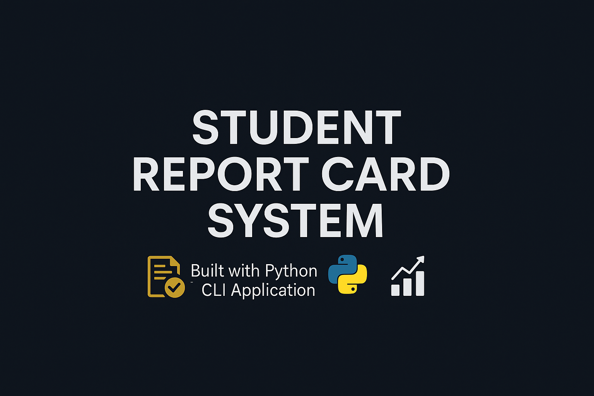

<p align="center">
  
</p>

<p align="center">
  
  
  
  
</p>

---

# 🎓 Student Report Card System

A professional, console-based Python application that helps manage student report cards with secure admin access, full grading logic, leaderboard generation, and file-based storage. Built with clean validation, backup handling, and test coverage.

---

## 📂 Folder Structure

```

STUDENT\_REPORT\_CARD/
│
├── LICENSE.md                  # MIT License
├── .gitignore                  # Ignores **pycache**, etc.
├── sample.txt                  # Sample report output
├── student_report_card.py      # Main application logic
├── banner.png                  # Project banner (for branding)
│
└── test/                       # Test scripts
├── test_add_student.py
├── test_delete_student.py
├── test_edit_student.py
└── test_search_student.py

```

---

## 🚀 Features

- 📥 Add student information with marks input
- 🔍 Search by Name, Roll Number, or Class
- ✏️ Edit existing student records
- 🗑️ Delete student records with confirmation and backup
- 📜 View all students' information
- 🏆 View top 3 position holders
- 📊 Leaderboard sorted by percentage
- 🔐 Admin login system (username/password)
- 💾 File backup system before data deletion/edit

---

## 🧪 Testing

Run each test file to validate core functionalities:

```bash
python test/test_add_student.py
python test/test_delete_student.py
python test/test_edit_student.py
python test/test_search_student.py
```

✅ All tests successfully run and verified.

---

## 🔐 Login Credentials

> **Username:** `admin`
> **Password:** `1234`

---

## 💡 Sample Output

Content from `sample.txt`:

```
=========================
📄 Students Report Card
Name: Ayesha Khan
Roll number: 1023
Class: 9A
English marks: 85
Maths marks: 92
Science marks: 78
Computer marks: 88
Urdu marks: 90
Islamiat marks: 80
Total marks: 513/600
Percentage: 85.50%
Grade: A+
=========================
```

---

## ⚙️ Requirements

* Python 3.6+
* No external libraries required

---

## 📝 License

Licensed under the MIT License. See [LICENSE.md](LICENSE.md) for full details.

---

## 🙋‍♀️ Author

Developed with 💻 by **Rumaisa Islam**
🔗 GitHub: [@Rumaisas-islam](https://github.com/Rumaisas-islam)

---

## ⭐ Feedback

If you found this helpful or learned something, please consider giving a ⭐ on [GitHub](https://github.com/Rumaisas-islam/student_report_card)!